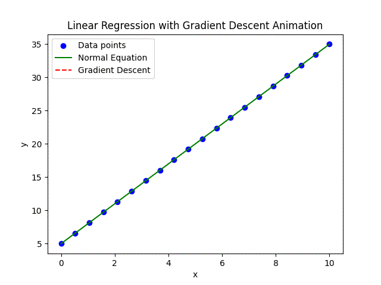
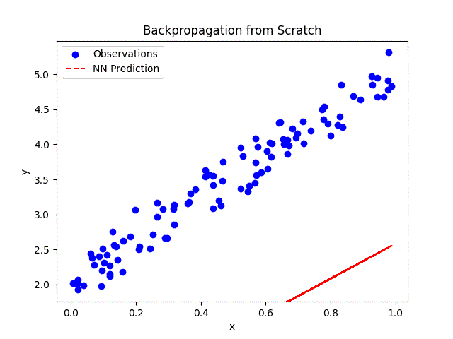

# Summary

This project serves as a learning tool for brushing up on practical applications of Linear Algebra, Calculus, and Probability.

I've chosen to apply these concepts to my areas of interest: robotics & quantitative finance.

The projects will start small, but will hopefully grow into something interesting.

## Study Notes

[Linear Algebra Notes & Worked Examples](LinAlgNotes.pdf)
[Calculus Notes & Worked Examples](CalcNotes.pdf)

# Project 1 - Linear Regression (appl. Lin Alg)

```
linear_regression.py
```



## Derivation of the Normal Equation

The **Normal Equation** is a closed-form solution that minimizes the MSE cost function to find the coefficients $\boldsymbol{\beta}$.

---

## Problem Setup

Linear regression will find $\boldsymbol{\beta}$ to fit a line to:

$$
\mathbf{y} = \mathbf{X} \boldsymbol{\beta} + \epsilon
$$

Where:
- $\mathbf{y} \in \mathbb{R}^m$: observations.
- $\mathbf{X} \in \mathbb{R}^{m \times n}$: inputs, where each row is a data point and each column is a feature. The first column is all ones to account for the intercept.
- $\boldsymbol{\beta} \in \mathbb{R}^n$: vector of coefficients to learn.
- $\epsilon \in \mathbb{R}^m$: noise vector injected into the model.
- $m$: number of observations.

Find $\boldsymbol{\beta}$ that minimizes the sum of squared errors (SSE) across data points.

---

## 1. Cost Function

Cost function:

$$
C(\boldsymbol{\beta}) = \frac{1}{2m} \|\mathbf{y} - \mathbf{X}\boldsymbol{\beta}\|^2
$$

Where:

$$
\|\mathbf{y} - \mathbf{X}\boldsymbol{\beta}\|^2 = (\mathbf{y} - \mathbf{X}\boldsymbol{\beta})^T (\mathbf{y} - \mathbf{X}\boldsymbol{\beta})
$$

---

## 2. Expand

Expand the squared term:

$$
\|\mathbf{y} - \mathbf{X}\boldsymbol{\beta}\|^2 = \mathbf{y}^T\mathbf{y} - 2\mathbf{y}^T\mathbf{X}\boldsymbol{\beta} + \boldsymbol{\beta}^T\mathbf{X}^T\mathbf{X}\boldsymbol{\beta}
$$

The cost function becomes:

$$
C(\boldsymbol{\beta}) = \frac{1}{2m} \left( \mathbf{y}^T\mathbf{y} - 2\mathbf{y}^T\mathbf{X}\boldsymbol{\beta} + \boldsymbol{\beta}^T\mathbf{X}^T\mathbf{X}\boldsymbol{\beta} \right)
$$

---

## 3. Cost Gradient

To minimize $C(\boldsymbol{\beta})$, take the gradient wrt $\boldsymbol{\beta}$ and set it to zero:

$$
\frac{\partial C(\boldsymbol{\beta})}{\partial \boldsymbol{\beta}} = \frac{\partial}{\partial \boldsymbol{\beta}} \left( \frac{1}{2m} \|\mathbf{y} - \mathbf{X}\boldsymbol{\beta}\|^2 \right)
$$

Using the expanded form:

$$
\frac{\partial C(\boldsymbol{\beta})}{\partial \boldsymbol{\beta}} = \frac{1}{m} \left( -\mathbf{X}^T\mathbf{y} + \mathbf{X}^T\mathbf{X}\boldsymbol{\beta} \right)
$$

Set the gradient to zero for minimization:

$$
\mathbf{X}^T\mathbf{X}\boldsymbol{\beta} = \mathbf{X}^T\mathbf{y}
$$

---

## 4. Solve for $\boldsymbol{\beta}$

Assume $\mathbf{X}^T\mathbf{X}$ is invertible (nonsingular):

$$
\boldsymbol{\beta} = (\mathbf{X}^T\mathbf{X})^{-1} \mathbf{X}^T\mathbf{y}
$$

This is the **Normal Equation**, which provides the optimal $\boldsymbol{\beta}$ to minimize the cost function.

---

## Assumptions

1. **Invertibility**: The matrix $\mathbf{X}^T\mathbf{X}$ must be invertible. If it’s not, we can just use SVD.
2. **Linearity**: The relationship between the features and target is assumed to be linear.

Regardless, ultimately we perform linear regression to find the coefficients. This derivation is just so we can check our work.

---

# Project 2 - NN Backpropagation (appl. Calc)

```
backprop_nn.py
```




# Backpropagation for Neural Network Training: Step-by-Step

## Step 1: Define the Neural Network Architecture
1. **Input Layer**: 1 node (e.g., scalar $x$). $x \in \mathbb{R}$
2. **Hidden Layer**: $n$ nodes with an activation function (e.g., ReLU or sigmoid). $h \in \mathbb{R}^n$
3. **Output Layer**: 1 node (e.g., scalar $\hat{y}$). $\hat{y} \in \mathbb{R}$

---

## Step 2: Initialize Weights and Biases
- Hidden layer weights $W_1 \in \mathbb{R}^{n \times 1}$
- Hidden layer biases $b_1 \in \mathbb{R}^n$
- Output layer weights $W_2 \in \mathbb{R}^{1 \times n}$
- Output layer bias $b_2 \in \mathbb{R}$

---

## Step 3: Forward Propagation
1. Compute the hidden layer activations:

$$
z_1 = W_1 x + b_1, \quad h = \sigma(z_1)
$$

Where $\sigma$ is an activation function (e.g., ReLU: $\sigma(z) = \max(0, z)$, or sigmoid: $\sigma(z) = \frac{1}{1 + e^{-z}}$).

2. Compute the output:

$$
z_2 = W_2 h + b_2, \quad \hat{y} = z_2
$$

3. Define the loss function:

$$
L = \frac{1}{N} \sum_{i=1}^N (y_i - \hat{y}_i)^2
$$

where $N$ is the number of training examples.

---

Activation Functions help with the following:

### 1. Introduce Non-Linearity
- **Problem**: Without activation functions, a neural network is just a stack of linear transformations:
  
$$
\mathbf{y} = \mathbf{W_2}(\mathbf{W_1}\mathbf{x} + \mathbf{b_1}) + \mathbf{b_2}
$$

This makes the network behave like a linear model, regardless of its depth.
- **Solution**: Activation functions apply **non-linear transformations** at each layer, allowing the network to learn complex relationships between input and output.


## 2. Allow the Network to Learn Complex Features
- Linear models are limited to learning **linear decision boundaries**.
- Non-linear activation functions enable the network to approximate continuous functions and solve problems with **non-linear decision boundaries**.


## 3. Control Neuron Activation
- Activation functions determine how much a neuron contributes to the output of the network.
- Example: **ReLU (Rectified Linear Unit)** activation:
  
$$
\sigma(z) = \max(0, z)
$$

  Neurons with $z \leq 0$ are effectively "turned off," introducing sparsity and improving computational efficiency.


## 4. Handle Gradient Flow
- Some activation functions (e.g., sigmoid, tanh) can cause gradients to become very small (vanishing gradient problem).
- Modern activation functions like **ReLU** and **Leaky ReLU** are designed to mitigate this by avoiding saturation for large inputs.
- Proper activation function selection ensures efficient gradient propagation during backpropagation, critical for training deep networks.

---

## Step 4: Backpropagation
1. Compute gradients for the output layer:
   - Derivative of the loss with respect to output layer weights $W_2$:

$$
\frac{\partial L}{\partial W_2} = \frac{1}{N} \sum_{i=1}^N -2 (y_i - \hat{y}_i) h_i
$$

   - Derivative of the loss with respect to output layer bias $b_2$:

$$
\frac{\partial L}{\partial b_2} = \frac{1}{N} \sum_{i=1}^N -2 (y_i - \hat{y}_i)
$$


2. Compute gradients for the hidden layer:
   - Backpropagate the error through the activation function:

$$
\delta = \frac{\partial L}{\partial \hat{y}} W_2 \odot \sigma'(z_1)
$$

$\odot$ is element-wise multiplication.

- Derivative of the loss with respect to hidden layer weights $W_1$:

$$
\frac{\partial L}{\partial W_1} = \frac{1}{N} \sum_{i=1}^N \delta_i x_i
$$

- Derivative of the loss with respect to hidden layer bias $b_1$:

$$
\frac{\partial L}{\partial b_1} = \frac{1}{N} \sum_{i=1}^N \delta_i
$$


3. Update weights and biases:
   - Output layer:

$$
W_2 \gets W_2 - \alpha \frac{\partial L}{\partial W_2}, \quad b_2 \gets b_2 - \alpha \frac{\partial L}{\partial b_2}
$$

   - Hidden layer:

$$
W_1 \gets W_1 - \alpha \frac{\partial L}{\partial W_1}, \quad b_1 \gets b_1 - \alpha \frac{\partial L}{\partial b_1}
$$

where $\alpha$ is the learning rate.

---

## Step 5: Train the Neural Network
1. Initialize weights and biases.
2. Loop through the dataset for a fixed number of epochs:
   - Perform forward propagation to compute the loss.
   - Perform backpropagation to compute gradients.
   - Update weights and biases using gradient descent.
3. Track the loss over epochs to ensure convergence.

---

## Optional: Evaluate the Trained Model
1. Use the trained network to make predictions on new data.
2. Compute evaluation metrics (e.g., MSE).